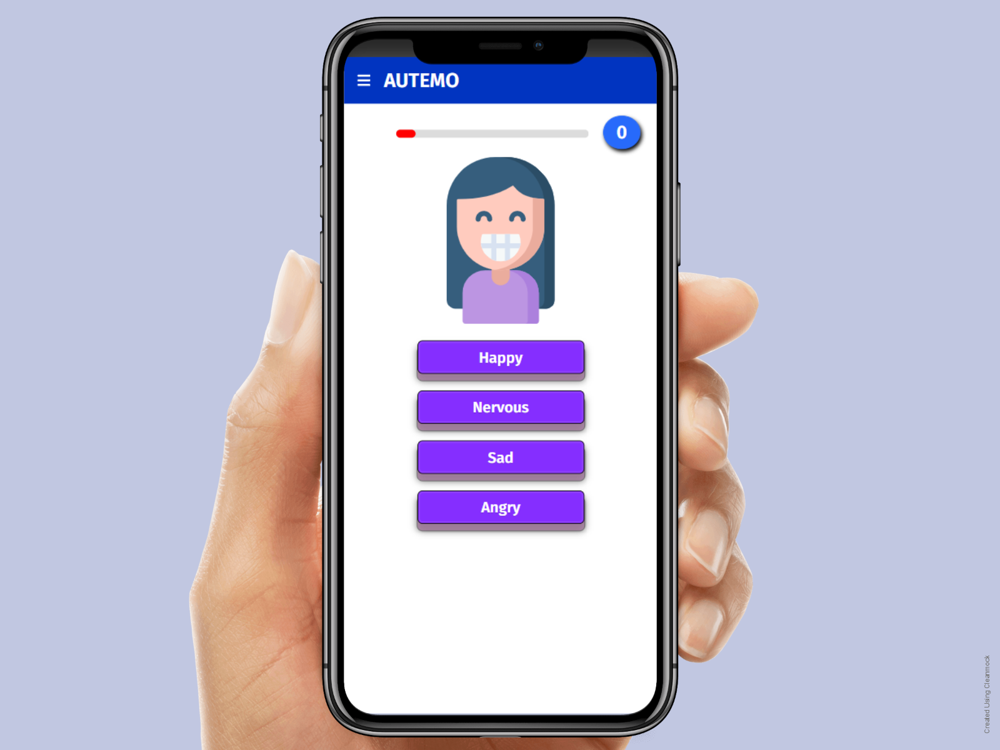
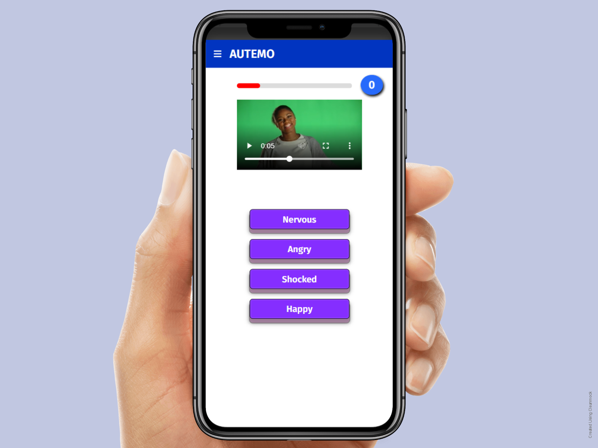
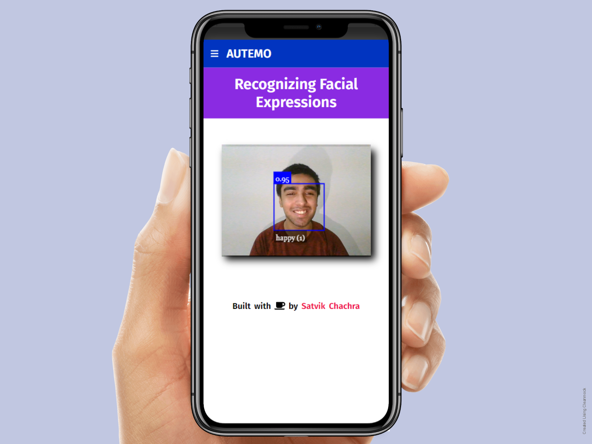
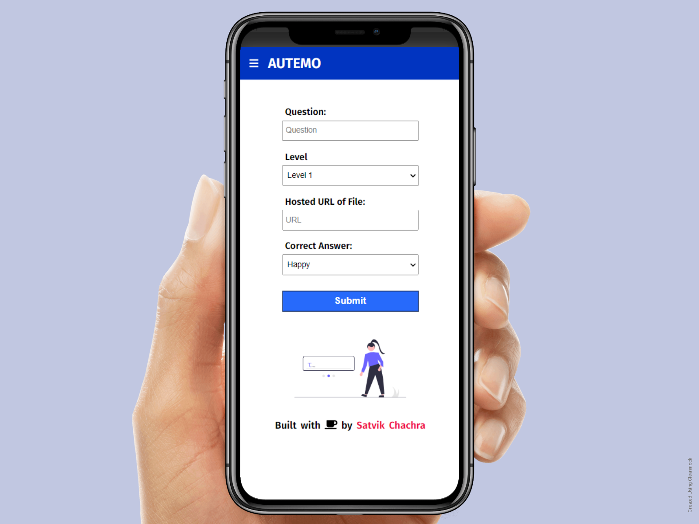

# Autemo
This website aims at improving emotional intelligence of the users (suffering from autism) by Gamifying the process. 

It is a web-based solution for children suffering from ASD to help them in interacting better in social scenarios, hence making social environments more accessible, and inclusive for them.

The game is divided into 3 quizzes where each quiz helps the user to interpret the emotion reflected on the screen through:
* Images
* Audio
* Video

## Live
<pre><a href="https://autemo.herokuapp.com">autemo.herokuapp.com</a></pre>

## Website Preview

This is a website built using MongoDB, Express.js, React.js, and Node.js (MERN Stack) in which CRUD operations are performed on Quiz Questions.

#### Image Quiz
Helping users recognizing emotions using facial expressions.<br><br>


#### Audio Quiz
Helping users recognizing complex emotions in voices.<br><br>


#### Video Quiz
Helping users recognizing complex emotions with videos.<br><br>


#### Real-Time Sentiment Analysis
Helping users recognize emotions with real-time sentiment analysis.<br><br>


#### Customize Quiz
Customize quizzes according to your needs by adding questions.<br><br>



## Set up

##### Clone the repository

```bash
git clone https://github.com/satvikchachra/autemo.git
```

##### Move to the desired folder

```bash
cd autemo
```

##### Set Environment Variables

* Create a `.env` file and add the following

```bash
MONGODBURL=Your MongoDB URL
```

##### Install Dependencies

```bash
npm install
cd client
npm install
```

##### Run

```bash
# Run frontend (:3000) & backend (:5000)
npm run dev

# Run frontend
npm run client

# Run backend
npm run server
```

## License

[MIT](LICENSE)

#### Built with :coffee: by [Satvik Chachra](https://github.com/satvikchachra)

[](https://github.com/satvikchachra)